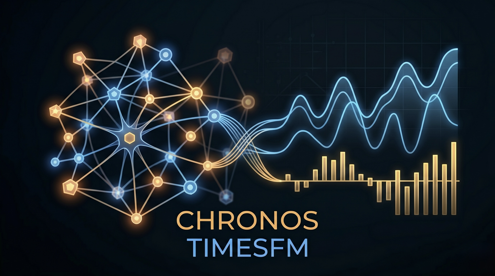

# AI-Driven Dynamic Portfolio Optimizer (TSFM Edition)

**English** | [한국어 (README.ko.md)](README.ko.md) | [日本語 (README.ja.md)](README.ja.md)

<p align="center">
  
</p>

<p align="center">
  
</p>

<p align="center">
  <a href="REPORT.md"></a>
  <a href="#demo-preview"></a>
</p>

<p align="center">
  
  
  
  
  <a href="LICENSE"></a>
</p>

Zero-shot time-series foundation models (TimesFM 1.0, Amazon Chronos-2) forecast expected returns; a Markowitz-style QP (`cvxpy`) builds long-only portfolios with sector and name caps. A two-tab **Gradio** app exposes single-asset forecasts and multi-asset optimization.

For the full narrative—evaluation rubric, model cards, notebook metrics, and gap analysis—see **[REPORT.md](REPORT.md)** (long-form; not duplicated here).

## Demo Preview


## Features

- **Data:** Automated multi-source pipeline (Kaggle S&P 500 bulk, `yfinance`, FRED + Kaggle macro) → `data/sp500_macro_master.csv`
- **Forecasting:** Dual-model weighted ensemble (Chronos-2 with macro covariates + univariate TimesFM 1.0)
- **Optimization:** Sharpe-oriented QP with budget, long-only, GICS sector ≤30%, single-name ≤25%
- **UI:** Gradio + Plotly (`app.py`): forecast tab + portfolio tab

## Tech stack

`torch`, `transformers`, `timesfm`, `chronos-forecasting`, `pandas`, `numpy`, `yfinance`, `fredapi`, `cvxpy`, `gradio`, `plotly`

---

## Quick start

**Requirements:** Python 3.10+ recommended; **CUDA GPU** strongly recommended for Chronos-2 / TimesFM inference.

```bash
python -m venv .venv
source .venv/bin/activate   # Windows: .venv\Scripts\activate
pip install -r requirements.txt
```

Configure credentials (next section), then build data and run the app.

Build the master dataset (see `scripts/build_dataset.py` for flags and behavior):

```bash
python scripts/build_dataset.py
```

Launch the dashboard:

```bash
python app.py
```

Optional: `python scripts/preload_models.py` to warm-cache Hub weights; `python scripts/run_experiments.py` for scripted experiments.

---

## Environment variables (`.env`)

1. Copy the template and edit values (never commit real secrets; `.env` is gitignored):

```bash
cp .env.example .env
```

2. **Loading behavior:** `src/forecast.py` calls `load_dotenv()`, so `python app.py` picks up `.env` from the project root automatically. `scripts/build_dataset.py` reads `os.environ` only—it does **not** load `.env` by itself. Either export variables in your shell, use [`direnv`](https://direnv.net/), or run once in Bash:

```bash
set -a && source .env && set +a && python scripts/build_dataset.py
```

| Variable | Used for | Notes |
|----------|-----------|--------|
| `HF_TOKEN` | Hugging Face Hub auth for Chronos-2 / TimesFM weights | **Required** for `app.py` and forecast notebooks (`src/forecast.py`). |
| `KAGGLE_USERNAME`, `KAGGLE_KEY` | Kaggle API download of bulk S&P 500 + macro CSVs | **Required** for the default `build_dataset.py` path unless data is already cached. Can be written to `kaggle.json` by the script from these env vars. |
| `FRED_API_KEY` | FRED macro series via `fredapi` | **Recommended**; if unset, FRED columns may be empty and the pipeline logs a warning (`--no-fred` skips explicitly). |
| `ALPHAVANTAGE_API_KEY` | — | Optional; reserved / not used by the core scripts in this repo today. |
| `OPENAI_API_KEY` | — | Optional; reserved / not used by the core scripts in this repo today. |

Get tokens from: [Hugging Face settings](https://huggingface.co/settings/tokens), [Kaggle account API](https://www.kaggle.com/settings), [FRED API keys](https://fred.stlouisfed.org/docs/api/api_key.html).

---

## Notebooks

| Notebook | Role |
|----------|------|
| `notebooks/01_chronos2_basic_inference.ipynb` | Chronos-2 zero-shot forecast demo |
| `notebooks/02_data_overview_visualization.ipynb` | EDA on prices + macro |
| `notebooks/03_portfolio_optimization_backtest.ipynb` | Ensemble μ + QP + walk-forward backtest |

Rendered figures and HTML exports live under `notebooks/` when cells are executed.

## Repository layout (high level)

```text
app.py                 # Gradio entrypoint
src/                   # Forecast + optimization modules
scripts/               # Dataset build, experiments, tests
data/                  # Built CSV (raw paths may be gitignored)
notebooks/             # Analysis + outputs
docs/                  # Extra templates / drafts
REPORT.md              # Full project report (long)
```

## License

This project is licensed under the **[PolyForm Noncommercial License 1.0.0](https://polyformproject.org/licenses/noncommercial/1.0.0/)** (SPDX: `PolyForm-Noncommercial-1.0.0`). It is **source-available** but **not** an OSI-approved “open source” license: noncommercial and certain organizational uses are permitted on the terms of the license; **commercial** exploitation (e.g. selling a product or service built on this code) is **not** covered—you need **separate written permission** from the copyright holder.

- **Copyright** © 2026 Jaehyun Park (see `Required Notice` in `LICENSE`). Redistributing the software requires passing along this license (or its URL) and the required notice lines.
- **Third-party stack:** PyTorch, Hugging Face models, Python packages, and datasets remain under **their** licenses; you must comply with those upstream terms in addition to this repository’s `LICENSE`.
- If you are unsure whether your use is noncommercial, or you want a commercial license, **contact the copyright holder** (see `LICENSE`).

The authoritative legal text is **[LICENSE](LICENSE)**; the above is a non-binding summary only.
